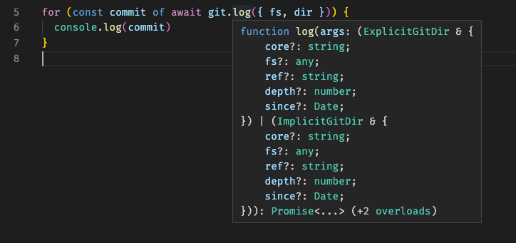
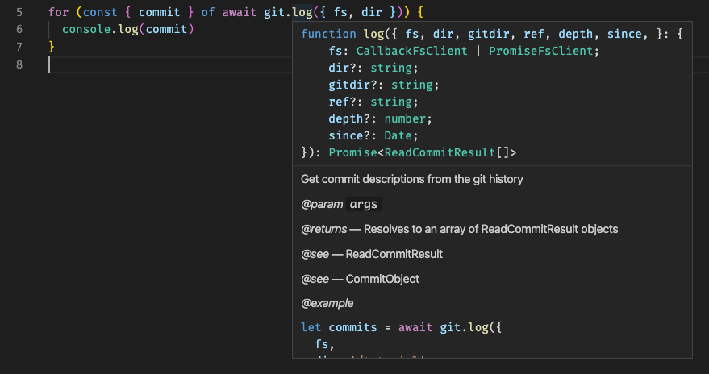
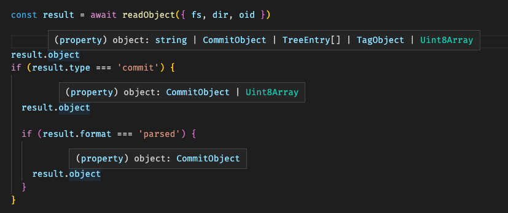
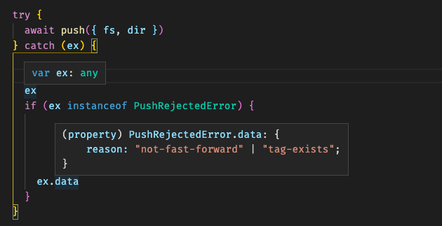

Today marks the release of isomorphic-git version 1.0! 🎉 There are a lot of big improvements to celebrate. 

- [Better IDE Integration](#better-ide-integration)
- [Better TypeScript Integration](#better-typescript-integration)
- [More Good Defaults, Fewer Bad Defaults](#more-good-defaults-fewer-bad-defaults)
- [Embrace Callbacks](#embrace-callbacks)
- [Future-proof API](#future-proof-api)
- [Acknowledgments](#acknowledgments)
- [1.0 Breaking Changes](#10-breaking-changes)
  - [Big changes](#big-changes)
  - [Some functions have been renamed or removed:](#some-functions-have-been-renamed-or-removed)
  - [Some function parameters have been removed or replaced:](#some-function-parameters-have-been-removed-or-replaced)
  - [The return types of some functions have changed:](#the-return-types-of-some-functions-have-changed)
  - [Some function behaviors have changed](#some-function-behaviors-have-changed)
  - [Docs and DX improvements](#docs-and-dx-improvements)
  - [Miscellaneous stuff](#miscellaneous-stuff)

## Better IDE Integration

No longer must we maintain the `index.d.ts` file by hand!
Thanks to improvements in TS 3.7, we can auto-generate the declaration file using [`tsc --declaration --allowJs`](https://devblogs.microsoft.com/typescript/announcing-typescript-3-7/#user-content---declaration-and--allowjs).
This has the added benefit that the JSDoc is also included in the `index.d.ts` which leads to a much richer IDE integration. Sadly, parameter descriptions still aren't shown, but the main description body and the example code are!

Here's what the Visual Studio Code tooltip for `git.log` looked like before:

And here's what it looks like in version 1.0:

The functions themselves have been tweaked so that the [core object interfaces](https://github.com/isomorphic-git/isomorphic-git/blob/master/src/typedefs.js) (`CommitObject`, `TreeEntry`, `TagObject`, etc) are reused wherever possible,
so that all the functions feel consistent and there are no surprises.
The result is a cleaner API where the documentation comes to you, right where you are.

## Better TypeScript Integration

The return types gel with TS better now. For example, `readObject` returns a "discriminated union" type, so you can take advantage of powerful type inference, like this:

Exceptions are also well-typed now, so you can access their `.data` property with confidence:

## More Good Defaults, Fewer Bad Defaults

A number of helpful behaviors that had to be opt-in before to preserve backwards compatibility are now the defaults.

- The `init` function doesn't overwrite your config file if it already exists.
- The `checkout` function now warns about conflicts instead of blindly overwriting files.
- The `commit` function doesn't silently remove submodules.

:shudder: You live, you learn, amirite?

A number of "helpful" default behaviors have been removed, because no default is better than a bad default:

A big one was assuming if you if you used the ESM build you were in the browser and had access to `fetch` and if you used the CommonJS build you were in node.
That simply isn't true in today's environment.
In version 1.0, you are always in control of whether to use `http/web` or `http/node`.

Another one was automatically appending `.git` to the end of URLs when you clone them. That _can_ be helpful, but it can also completely break cloning for some servers, which led to the awkward addition of the `noGitSuffix` parameter (cringe).
In version 1.0, the URL you give is the URL we GET.

## Embrace Callbacks

Something I tried to do early-ish in the development of 0.x was to move towards this idea that all function arguments need to be serializable.
My reasoning was this:

1. isomorphic-git can be pretty slow and block the main thread.
2. I should encourage everyone to use isomorphic-git in a Worker.
3. Therefore, I should make it easy to wrap isomorphic-git in a postMessage / RPC interface.

This led to the creation of [`magic-portal`](https://www.npmjs.com/package/magic-portal) and publishing the WebWorker Guide.
It also was the main constraint driving the design of the plugin system.
The idea was all the callbacks could be setup in one place.

However, since that time I have grown a tad wiser. In building real-world applications with isomorphic-git, I've realized:

1. _All_ code can be pretty slow and block the main thread.
2. Therefore all the code that _uses_ isomorphic-git should be in that Worker too.
3. In that case, isomorphic-git doesn't need serializable arguments at all.

Therefore the plugin system and its awkward global state and funky namespace "cores" are gone, replaced by a vastly simpler collection of callback arguments.
The new code is safer, has better locality when you're reading it, and enables some cool new behaviors like canceling running functions and infinite retry for interactive authentication.

## Future-proof API

A number of other changes, such as returning `Uint8Array` instead of `Buffer`, were done to pave the way for future refactoring.
The size of the library can be shrunk significantly if we drop the `Buffer` polyfill dependency.
Plus, Webpack 5 reportedly won't provide node polyfills automatically.

As always, all the functions are `async` and take named arguments, which makes adding new features without breaking old ones easy! I'm a huge fan of this pattern, and I think it's been very successful.

It is safe to say that the API for isomorphic-git will remain backwards compatible and have no breaking changes for at least a year, possibly two or three.
Because I want you to always be able to upgrade to the latest and greatest version of `isomorphic-git` without having to change any of your code.

Except for today. Today, we are making breaking changes because it is a major release.

## Acknowledgments

A HUGE THANK YOU to _everyone_ who used isomorphic-git 0.x.
You've been tremendously helpful, and you early adopters have helped make this project of mine fun and fulfilling!

And an even bigger thanks to [everyone who contributed directly](https://github.com/isomorphic-git/isomorphic-git#contributors)!
Seeing other people help improve the codebase has warmed my heart.
And seeing your bug reports at least lets me know it is getting lots of use!

I'd like to thank a couple corporations, particularly [Cardstack](https://cardstack.com/?utm_source=opencollective&utm_medium=github&utm_campaign=isomorphic-git), [CleverCloud](https://www.clever-cloud.com/?utm_source=ref&utm_medium=link&utm_campaign=isomorphic-git), and [OpenDevise](https://opendevise.com/?utm_source=opencollective&utm_medium=github&utm_campaign=isomorphic-git).

Lastly, I'd like to thank [Stoplight, Inc](https://stoplight.io/?utm_source=isomorphic-git&utm_medium=isomorphic-git-blog&utm_campaign=isomorphic-git) for hiring me and letting me work on isomorphic-git occasionally as part of my regular day job!
Everyone has benefitted from the bugfixes, perf, and usability enhancements that have resulted from our using isomorphic-git in our world-class API designer, Stoplight Studio.

---

## 1.0 Breaking Changes

### Big changes
- The supported node & browser versions have been bumped. (See beautiful table above.)
- The plugin system has been eliminated and we're back to plain old dependency injection via function arguments! The plugin cores created a mysterious "global state" that makes it easy to trip up (I myself sometimes forgot to unset plugins after running tests). The old style of passing `fs` as a function argument was less aesthetic and more verbose, but it is a much simpler model than the plugin core model, and much safer because it makes it impossible for dependencies to accidentally share the default plugin core.
  - The `emitter` plugin has been replaced with `onMessage` and `onProgress` callbacks.
  - The `credentialManager` plugin has been replaced with `onAuth`, `onAuthFailure` and `onAuthSuccess` callbacks
  - The `fs` plugin has been replaced with an `fs` parameter.
  - The `http` plugin has been replaced with an `http` parameter.
  - The `pgp` plugin has been replaced with an `onSign` callback.
- There is an additional setup step to choose which `http` client to use, and functions that make HTTP requests have a new required `http` parameter. Previously I used a mix of bundler and runtime magic to try and pick between a build that used `fetch` and one that used `require('http')` but that didn't always work. For instance, if you were bundling a node application using Webpack, it would pick the wrong build [(#938)](https://github.com/isomorphic-git/isomorphic-git/issues/938). Another example: in an Electron renderer thread, _both_ options could work (if the window is launched with `nodeIntegration: true`) but in a Web Worker thread only the fetch option should work (_unless_ you have `nodeIntegrationInWorker: true` set). See "Getting Started" below to see the extra line of code you need.
- The files in the package have been renamed so the import paths are short and sweet:
  - `dist/bundle.umd.min.js` -> `index.umd.min.js`
  - `dist/for-future/isomorphic-git/index.js` -> `index.js` (the future has arrived)
  - `dist/for-node/isomorphic-git/index.js` -> `index.cjs`

### Some functions have been renamed or removed:
- The `walkBeta2` function was renamed to `walk`.
- The `walkBeta1` function was removed.
- The `fastCheckout` function has been renamed `checkout` and the old `checkout` has been removed.
- The (previously deprecated) `sign` function was removed.
- The (previously deprecated) `utils.auth` function was removed.
- The (previously deprecated) `utils.oauth2` was removed.
- The `config` function has been removed and replaced by `getConfig`, `getConfigAll`, and `setConfig`.
- The `verify` function has been removed, but `log`, `readCommit`, and `readTag` all return the `gpgsig` and signing `payload` now. This actually makes verification simpler and more efficient, because it can be done in batch on `git.log` output and the `gpgsig` itself can be parsed and used to lookup the public key. See [onSign](https://isomorphic-git.org/docs/en/onSign) for complete code examples.

### Some function parameters have been removed or replaced:
- The undocumented parameter aliases `authUsername` and `authPassword` were removed.
- The `emitter` parameter was removed and replaced with the `onMessage` and `onProgress` callbacks. (Note that `onMessage` emits un-trimmed strings, so you get those `\r`s.)
- The `username`, `password`, `token`, and `oauth2format` parameters were removed and replaced with the `onAuth` callback.
- The `fast` parameter of `pull` was removed, since there is no "slow" implementation anymore.
- The `signing` parameter of `log` was removed, since `log` will always return a payload.
- The `pattern` parameter was removed from `statusMatrix` and replaced with a new `filter` function. (This is so we can drop the dependencies on `globalyzer` and `globrex`.)
- The `newSubmoduleBehavior` parameter was removed and is now the default and only behavior, because it makes much more sense to have non-destructive defaults!
- The `noSubmodules` parameter was removed because with the new submodule behavior it is no longer necessary to print console warnings about how submodules aren't supported. (When submodule support IS added to isomorphic-git, it will be opt-in using `recurseSubmodules: true` or something like that.)
- The `autoTranslateSSH` feature was removed, since it is trivial to implement your own version using just the `UnknownTransportError.data.suggestion`
- The `writeObject` function when used to write a tree now expects a plain array rather than an object with a property called `entries` which is the array. (This is so that argument to `writeObject` has the same shape as the arguments to `writeBlob`/`writeCommit`/`writeTag`/`writeTree`.)
- The `noOverwrite` parameter was removed from `init` and is the new behavior.
- The `author.date`, `committer.date`, `tagger.date` parameters were removed in favor of `author.timestamp`, `committer.timestamp`, `tagger.timestamp` in order to be clear about what is actually written and share the same shape as the return types in `readCommit`, `log`, and `readTag`.

### The return types of some functions have changed:
- Functions that used to return `Buffer` objects now return `Uint8Array` objects. (This is so we can eventually remove all internal dependencies on the Buffer browser polyfill, which is quite heavy!)
- The `log` function now returns an array of the same kind of objects that `readCommit` returns. (This change simplifies the type signature of `log` so we don't need function overloading; that function overloading was the one thing preventing me from auto-generating `index.d.ts`.)
- The `readObject` function returns a proper discriminated union so TypeScript can infer the type of `.object` once you establish the value of `.format` and `.type`. Also `.object` has the same shape as as the return value of `readBlob`/`readCommit`/`readTag`/`readTree`. (Meaning trees are now plain arrays rather than objects with a `.entries` property that is the array.)

### Some function behaviors have changed
- The `push` function now pushes to the remote tracking branch (rather than a branch with the same name) by default.

### Docs and DX improvements
- The `docs/alphabetic.md` and function list in `README.md` are auto-generated from the filenames in `src/api`.
- Nearly the entire docs website is auto-generated from the JSDoc actually so keeping the docs website and source code in sync is easier.
- All the example code in JSDoc is now type-checked during CI tests.
- The live code examples on the website are displayed in a full-blown mobile-friendly code editor (CodeMirror 6).
- Each page with live code examples includes a code snippet at the bottom to reset the browser file system.
- The Getting Started guide has been updated.
- All the example code in JSDoc has been updated.

### Miscellaneous stuff
- Update the README to recommend LightningFS rather than BrowserFS.
- The `internal-apis` bundle is no longer included in the published package. That was only being built to run the unit tests.
